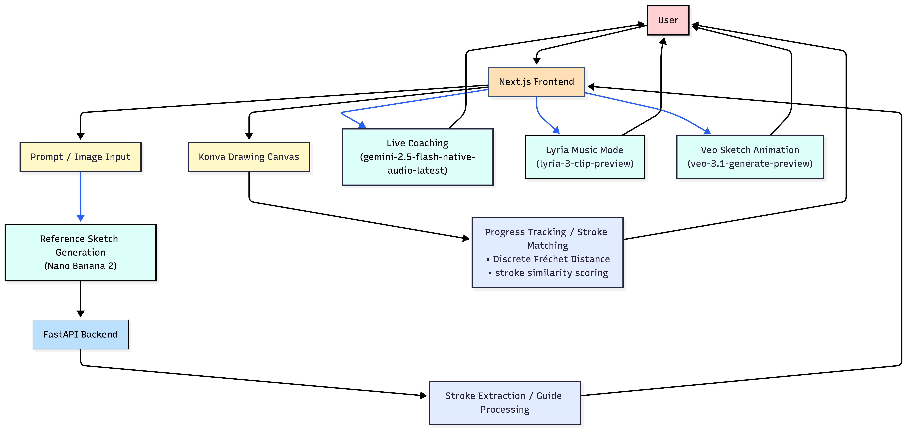
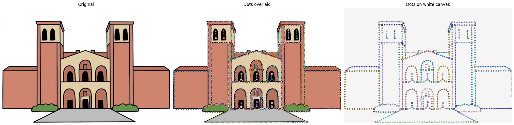

# Draw with DoodleDojo

Doodle Dojo turns any photo or text idea into guided sketching lessons, gives live AI coaching while you draw, and then animates your final sketch into a short video.

Most people want to draw better, but tutorials are either too generic, too long, or not interactive. Beginners need feedback in the moment, not after they finish.


## How It Works

1. The user uploads an image or types a prompt.
2. The Gemini generates a simplified sketch for reference.
3. That sketch is sent to the backend for stroke-guide processing.
4. As the user finishes strokes, the app advances through the guide sequence and updates progress.
5. Gemini Live can provide feedback while the user draws.
6. If coach voice is off, the user can prompt Lyria with lyrics or vibe guidance and let music play while they draw.
7. At the end, the user can animate the sketch with Veo and save the result.

## Diagram


## Stroke Extraction Algorithm
See [backend/notebooks/stroke_extraction.ipynb](backend/notebooks/stroke_extraction.ipynb)
for details on the stroke extraction and clustering algorithm.



## Tech Stack

- Frontend: `Next.js 16`, `React 19`, `TypeScript`, `Tailwind CSS 4`, `Framer Motion`, `Konva`, `Zustand`
- Backend: `google-genai`, `FastAPI`, `Python 3.12`, `uv`
- Gemini: `Nano Banana 2`, `Lyria 3 Pro preview`, `Gemini 3.1`, `Veo 3.1`

## Project Structure

```text
doodledojo/
├── backend/    # FastAPI app for reference upload + stroke processing
└── frontend/   # Next.js app for the drawing experience
```

## Running Locally

### Backend
```bash
# Install uv (if you don't have it)
curl -LsSf https://astral.sh/uv/install.sh | sh

cd backend
uv sync

# Create backend/.env with GEMINI_API_KEY=xyz

uv run uvicorn main:app --reload

# Docs hosted at http://localhost:8000/docs
```

### Frontend

```bash
cd frontend
npm install
npm run dev

# Available at http://localhost:3000
```

## Environment Variables

Create `frontend/.env.local`:

```bash
NEXT_PUBLIC_GEMINI_API_KEY=your_api_key_here
NEXT_PUBLIC_BACKEND_URL=http://localhost:8000
```

Optional frontend vars:

```bash
GEMINI_VEO_MODEL=veo-3.1-generate-preview
NEXT_PUBLIC_GEMINI_LIVE_MODEL=gemini-2.5-flash-native-audio-latest
NEXT_PUBLIC_LYRIA_MODEL=lyria-realtime-exp
NEXT_PUBLIC_GEMINI_LIVE_DEBUG=0
```

## Key Endpoints

Frontend API routes:

- `/api/generate-style`
- `/api/upload-reference`
- `/api/get-strokes`
- `/api/coaching`
- `/api/tts`
- `/api/animate-sketch`
